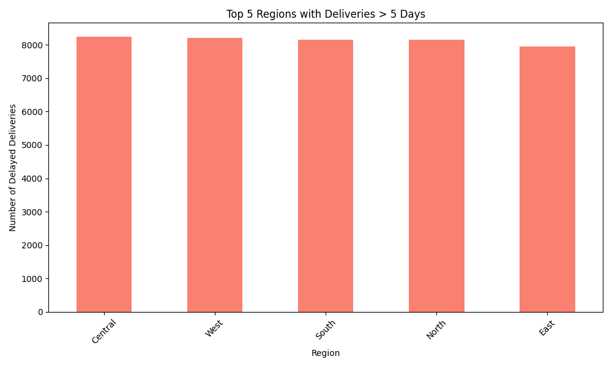

# E-Commerce Delivery Optimization


## Business Problem
In the highly competitive e-commerce landscape, optimizing logistics is critical. Delivery delays directly impact customer satisfaction, brand loyalty, and operational costs. This project aims to identify and flag delayed deliveries (taking more than 5 days) and highlight the regions experiencing the most significant logistical bottlenecks. By understanding these patterns, the business can proactively route shipments, allocate more regional delivery partners, and set realistic delivery expectations for customers.

## Tech Stack
* **Python**: Core programming language.
* **Pandas**: For robust data manipulation and time-series date processing.
* **Matplotlib**: For generating clear, professional data visualizations.

## Methodology
1. **Data Ingestion**: The script loads the raw sales data from the `data/` directory.
2. **Data Transformation**: Order and delivery dates are converted into datetime objects to calculate the exact delivery duration in days.
3. **Metric Calculation**: The script calculates the Average Shipping Cost across the dataset to provide a baseline financial metric.
4. **Anomaly Detection**: Deliveries taking more than 5 days are flagged as "Delayed".
5. **Visualization**: The top 5 regions with the highest count of delayed deliveries are extracted and visualized using a bar chart.

## Project Structure
* `data/`: Contains the raw dataset.
* `src/`: Modularized python scripts (`data_loader.py`, `analysis.py`).
* `main.py`: The entry point script to run the analysis pipeline.
* `requirements.txt`: Python package dependencies.

## Results
After running the pipeline on the 50,000 record dataset, we observed the following:
* **Average Shipping Cost:** 138.84 INR

Below is the visualization of the top regions experiencing severe delays:



## Setup Instructions
**Prerequisites:**
Place the dataset inside the `data/` directory and rename it to `ecommerce_sales.csv`. 

Install dependencies:
```bash
pip install -r requirements.txt
```

**Execution:**
Run the analysis pipeline using the following command:
```bash
python main.py
```
